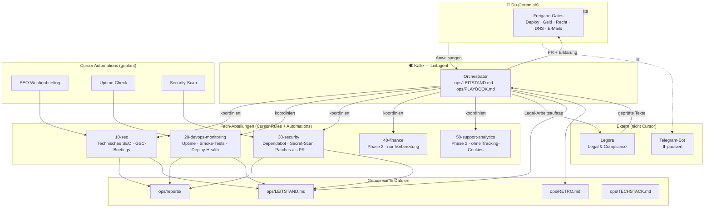

# Organigramm — KiezQuiz Agenten-Struktur

> Mermaid rendert auf GitHub als Diagramm. Stand: 2026-06-15

## Freigabe-Gates (nur du)

| Aktion | Gate |
|---|---|
| Merge auf `main` / Live-Deploy | ✅ dein OK |
| E-Mails an Nutzer (NB, Marketing) | ✅ dein OK |
| Rechtstexte veröffentlichen | ✅ Legora + dein OK |
| DNS / Domain / Cloudflare-Redirect | ✅ dein OK |
| Supabase Pro / kostenpflichtige Upgrades | ✅ dein OK |
| Buchungen / Steuer | ✅ du + Steuerberater |

## Änderungshistorie

| Datum | Änderung |
|---|---|
| 2026-06-15 | Erstversion: Kalle, SEO, DevOps, Security; Telegram pausiert; Finance/Support Phase 2 |
