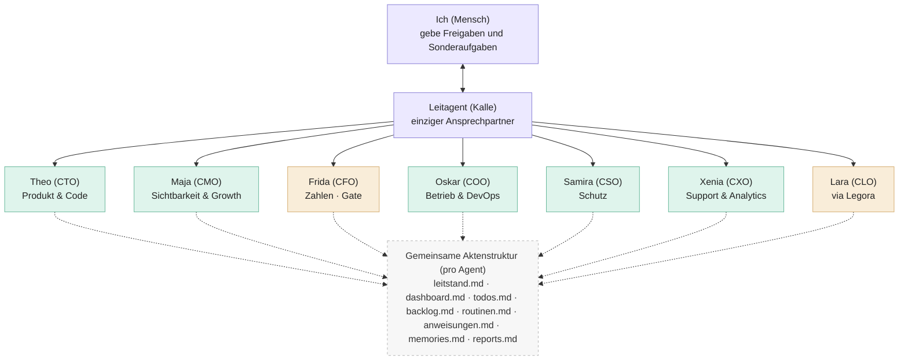

# Organigramm — KiezQuiz AI-Management (Gesamtüberblick)

> **Zweck:** Ein Ort, an dem du **das komplette KI-Management auf einen Blick** verstehst und prüfen kannst — wie ein Wirtschaftsprüfer.
> Wer macht was, wo liegt jede Datei, wer hält sie aktuell, was läuft automatisch, und was müsstest du bei einem Umzug mitnehmen.
> **Pflege:** Kalle (Leitagent) — aktualisiert bei jeder Strukturänderung im selben Arbeitsschritt. Stand: **2026-06-15** (v2 Agenten-Akten)

**So liest du dieses Dokument**
- **Kapitel 1** = das Bild (Organigramm als Diagramm).
- **Kapitel 2–8** = jede Bausteinart einzeln als Tabelle (Agenten, MCPs, Automationen, Actions, Hooks, Skills, Skripte).
- **Kapitel 9** = Datei-Landkarte: *wo* liegt was, *wer* pflegt es, *wie oft*.
- **Kapitel 10** = Todos: wo sie liegen und wie du sie abrufst.
- **Kapitel 11** = Umzugs-Checkliste: was du bei Systemwechsel mitnehmen musst (v. a. nur-lokale Dateien).
- **Kapitel 12** = Freigabe-Gates · **Kapitel 13** = Dashboard.

**Begriffe in einem Satz**
- **Agent** = eine KI-Rolle mit klarem Auftrag (bei uns: eine Regel-Datei unter `.cursor/rules/`).
- **MCP** = „Steckdose", über die Kalle echte Dienste bedient (z. B. Supabase, Notion) — *Model Context Protocol*.
- **Automation** = zeitgesteuerter Agent auf cursor.com, der von allein Berichte/PRs erzeugt.
- **GitHub Action** = Automatik direkt im Code-Repo (z. B. Deploy, Backup) — läuft bei GitHub, nicht in Cursor.
- **Hook** = kleines Skript, das automatisch nach einer Datei-Änderung anspringt.

---

## 1. Das Organigramm (Diagramm)

> Mermaid rendert auf GitHub automatisch als Bild. Im Admin-Dashboard (Profil → AI-Management) siehst du Kalle + Fach-Agenten als Karten.

---

## 2. AI-Agenten (C-Level + Regel-Dateien)

> Jeder Agent hat eine **Akte** unter `ops/agents/<id>/` (8 Markdown-Dateien) und eine **Cursor-Regel** unter `.cursor/rules/`.

| Agent | Akte | Regel-Datei | Auftrag (kurz) |
|---|---|---|---|
| 🕊️ **Kalle — CEO** | `ops/agents/ceo-kalle/` | `00-leitagent.mdc` | Orchestriert alles |
| 🛠️ **Theo (CTO)** | `ops/agents/cto-ingenieur/` | `deploy-and-cache-busting.mdc` | Code, Deploy, Layout |
| 💰 **Frida (CFO)** | `ops/agents/cfo-finanzen/` | `40-finance.mdc` | Kosten, Free-Tier |
| ⚖️ **Lara (CLO)** | `ops/agents/clo-legal/` | `60-legal-coordination.mdc` | Legora-Koordination |
| 📈 **Maja (CMO)** | `ops/agents/cmo-seo-growth/` | `10-seo.mdc` | Technisches SEO |
| ⚙️ **Oskar (COO)** | `ops/agents/coo-operations/` | `20-devops-monitoring.mdc` | Uptime, Backup |
| 🔒 **Samira (CSO)** | `ops/agents/cso-security/` | `30-security.mdc` | Dependabot, RLS |
| 💬 **Xenia (CXO)** | `ops/agents/cxo-support-analytics/` | `50-support-analytics.mdc` | Stadt-Wünsche |

Register: `ops/agents/registry.json` · Protokoll: `ops/agents/PROTOKOLL.md`

**Weitere Regeln (kein eigener C-Level-Ordner):** `terms-change-notify.mdc`, `Layout.mdc`

---

## 3. MCPs & Connections (Kalles Werkzeuge)

> MCP = „Steckdose" zu einem echten Dienst. Damit kann Kalle z. B. die Datenbank lesen oder DNS prüfen — ohne dass du Passwörter herausgibst.
> **Wichtig fürs Audit:** MCP-Zugänge sind **an deinen Cursor-Account gebunden** (Cloud), **nicht** als Datei im Repo. Beim Umzug → Kapitel 11.

| MCP / Connection | Wofür | Wo eingerichtet | Status |
|---|---|---|---|
| **Supabase** | Datenbank, Auth, Edge Functions, Advisors, Logs | Cursor-Account (Cloud) | 🟢 |
| **Cloudflare** (Docs, Bindings, Builds, Observability) | DNS, Workers, Logs für `lauer.team` | Cursor-Account (Cloud) | 🟢 |
| **Notion** | Projekt-Doku „JJL - TBD - KiezQuiz" | Cursor-Account (Cloud) | 🟢 |
| **Cursor App-Control / IDE-Browser** | Cursor selbst steuern, Browser-Tests | Cursor (eingebaut) | 🟢 |
| **GitHub (`gh` CLI)** | PRs, Secrets, Actions, Releases | lokal + Repo-Auth | 🟢 |

Details & Zugangsstatus: **`ops/ZUGAENGE.md`** · Anbieterliste: **`ops/TECHSTACK.md`**

---

## 4. Cursor Automations (zeitgesteuerte Agenten)

> Laufen auf **cursor.com/automations** (Cloud) in einer isolierten Sandbox. Jede legt nur **Berichte/PRs** vor — nie direkt live.
> Die **Konfig-Texte** (zum Wiederherstellen) stehen in **`ops/agents/ceo-kalle/routinen.md`**. Die laufenden Automationen selbst leben in deinem Cursor-Account.

| # | Name | Cron (UTC) | Im Klartext | Aufgabe | Bericht nach |
|---|---|---|---|---|---|
| 0 | Backup Archiv Sync | `0 10 2 * *` | am 2. jeden Monats, 10:00 | Backup-Artifact ins Supplement-Archiv | `reports/…-backup-archiv.md` |
| 1 | Uptime Smoke Check | `0 8 * * 1-5` | werktags 08:00 | kiezquiz.de erreichbar? | `…-devops-smoke-check.md` |
| 2 | Security Weekly | `0 7 * * 1` | montags 07:00 | Dependabot + Supabase Advisors | `…-security-weekly.md` |
| 3 | SEO Weekly | `0 9 * * 1` | montags 09:00 | Sitemap, SEO-Tests, GSC-Hinweis | `…-seo-weekly.md` |
| 4 | Ops Weekly Review | `0 7 * * 1` | montags 07:00 | Fälligkeiten aus `DEADLINES.md` | `…-ops-weekly.md` |
| 5 | Finance Monthly | `0 8 1 * *` | am 1., 08:00 | Kosten, Free-Tier, Quotas | `…-finance-monthly.md` |
| 6 | Support Monthly | `0 10 1 * *` | am 1., 10:00 | Stadt-Wünsche, Trends | `…-support-monthly.md` |
| 7 | **Leit-Routine / Orchestrator** | `0 6 * * 1` | montags 06:00 | **Koordiniert alle Automationen, prüft was fällig ist, baut Dashboard neu** | `…-orchestrator.md` |

**Wie du eine neue anlegst / wiederherstellst:** Schritt-für-Schritt in `ops/agents/ceo-kalle/routinen.md`.

---

## 5. GitHub Actions (Automatik im Code-Repo)

> Laufen bei **GitHub**, nicht in Cursor. Dateien liegen in `.github/workflows/` (in Git gesichert).

| Workflow | Datei | Auslöser | Was |
|---|---|---|---|
| **Deploy** | `.github/workflows/deploy.yml` | Push auf `main` | Baut & deployt nach kiezquiz.de (GitHub Pages) |
| **Supabase Backup** | `.github/workflows/supabase-backup.yml` | 1. jeden Monats, 03:00 UTC | `pg_dump` → Artifact |
| **Backup-Erinnerung** | `.github/workflows/backup-reminder.yml` | 2. jeden Monats, 09:00 UTC | E-Mail an info@kiezquiz.de |
| **NB-Benachrichtigung** | `.github/workflows/notify-terms.yml` | manuell/bei NB-Änderung | E-Mail via iCloud SMTP |

---

## 6. Hooks (automatische Mini-Skripte)

| Hook | Datei | Auslöser | Was |
|---|---|---|---|
| Nach NB-/Legal-Änderung | `.cursor/hooks/after-terms-edit.sh` | nach Datei-Änderung (`afterFileEdit`) | erinnert an NB-Prozess | 
| Konfiguration | `.cursor/hooks.json` | — | verbindet Hook mit Ereignis |

---

## 7. Skills (Fähigkeiten-Bausteine)

> Skills sind wiederverwendbare Anleitungen für KI-Agenten. **Projekt-Skills** stehen in Git; **persönliche/Plugin-Skills** liegen in deinem Cursor-Profil (`~/.cursor/`), **nicht** im Repo.

| Art | Wo | Beispiele | Im Repo? |
|---|---|---|---|
| Cursor-System-Skills | `~/.cursor/skills-cursor/` | automate, canvas, create-rule, loop, split-to-prs | nein (Profil) |
| Plugin-Skills (Notion) | `~/.cursor/plugins/…/notion-workspace/` | create-page, database-query, search | nein (Profil) |
| Plugin-Skills (Cloudflare) | `~/.cursor/plugins/…/cloudflare/` | workers-best-practices, wrangler | nein (Profil) |
| Plugin-Skills (Supabase) | `~/.cursor/plugins/…/supabase/` | supabase, postgres-best-practices | nein (Profil) |
| **Projekt-Skills** | `.cursor/` (derzeit keine eigenen) | — | — |

**Audit-Hinweis:** Skills ändern nicht selbst etwas — sie sind „Kochrezepte". Beim Umzug → Kapitel 11.

---

## 8. Skripte (`scripts/`)

> Python/JS-Helfer, die Agenten oder du ausführen. **Alle in Git** (außer Konfig-Dateien mit Secrets, siehe Kapitel 11).

| Bereich | Skripte (Auswahl) |
|---|---|
| **Dashboard** | `scripts/build_ai_dashboard_data.py` (baut `ops/_generated/dashboard-data.json`) |
| **Deploy/Build** | `stamp_build.py`, `assemble_html.py`, `build_device_layouts.py` |
| **SEO** | `generate_seo_pages.py`, `generate_sitemap.py`, `test_seo_compat.js`, `gsc_weekly_brief.py` |
| **Assets** | `generate_assets.py`, `generate_*_assets.py` (Städte), `generate_og_image.*` |
| **Backup** | `export_supabase_backup.py`, `setup_supabase_backup.py`, `sync_supabase_backup_artifact.py` |
| **Legal/NB** | `notify_terms_change.py`, `deactivate_terms_notice.py`, `setup_terms_notify.py`, `generate_legal_static.py`, `export_compliance_pdf.py` |
| **Mail** | `send_backup_reminder.py` |
| **Tests** | `test_migration_v2.js`, `test_cloud_merge_v2.js`, `test_leaderboard_rank.js`, `test_rank_rederive.js` |

Vollständige Liste: Ordner `scripts/` öffnen.

---

## 9. Datei-Landkarte — *wo liegt was, wer pflegt es, wie oft*

> Die wichtigste Tabelle fürs Audit. **„Ort"**: 🟩 in Git (auf GitHub gesichert) · 🟦 nur lokal (Mac) · ☁️ Cloud-Dienst.

| Bereich | Datei / Ort | Ort | Wer pflegt | Wie oft |
|---|---|---|---|---|
| **Status (Quelle der Wahrheit)** | `ops/agents/ceo-kalle/leitstand.md` | 🟩 | Kalle | bei jeder Statusänderung |
| **Agenten-Akten** | `ops/agents/*/` (8 Dateien je Agent) | 🟩 | Fach-Agenten/Kalle | bei Reports |
| **Pointer Leitstand** | `ops/agents/ceo-kalle/leitstand.md` | 🟩 | Kalle | bei Statusänderung |
| **Termine** | `ops/agents/ceo-kalle/todos.md` | 🟩 | Kalle + du | bei neuen Fristen / Ops Weekly |
| **Aufgeschobenes** | `ops/agents/ceo-kalle/backlog.md` | 🟩 | Kalle | bei Bedarf |
| **Regelwerk** | `ops/agents/ceo-kalle/anweisungen.md` | 🟩 | du (Auftrag) / Kalle | selten |
| **Organigramm (dieses Dok.)** | `ops/agents/ORGANIGRAMM.md` | 🟩 | Kalle | bei Strukturänderung |
| **Dashboard** | `ops/_generated/dashboard-data.json` (+ Legacy `dashboard.html`) | 🟩 | `build_ai_dashboard_data.py` | auf Abruf + Orchestrator |
| **Tech-Stack** | `ops/TECHSTACK.md` | 🟩 | Kalle | bei neuem Dienst |
| **Zugänge** | `ops/ZUGAENGE.md` | 🟩 | Kalle | bei neuem Zugang |
| **Automations-Konfig** | `ops/agents/ceo-kalle/routinen.md` | 🟩 | Kalle | bei neuer Automation |
| **Berichte** | `reports/` | 🟩 | Automationen / Agenten | bei jedem Lauf |
| **Learnings** | `ops/RETRO.md` | 🟩 | Kalle | nach größeren Läufen |
| **Finance** | `leitstand.md (SERVICES)`, `COSTS.md` | 🟩 | Finance/Kalle | monatlich |
| **Legal** | `ops/agents/clo-legal/*` | 🟩 | Legal-Koordination | quartalsweise / bei Trigger |
| **Agenten-Regeln** | `.cursor/rules/*.mdc` | 🟩 | Kalle | bei Learnings |
| **Hooks** | `.cursor/hooks/*`, `.cursor/hooks.json` | 🟩 | Kalle | selten |
| **Actions** | `.github/workflows/*` | 🟩 | Kalle | bei Bedarf |
| **Skripte** | `scripts/*` | 🟩 | Kalle | bei Bedarf |
| **Lokale Projekt-Info** | `LOCAL-INFO.md` | 🟦 | du | bei Bedarf |
| **Supabase-Keys (lokal)** | `src/supabaseConfig.js` | 🟦 | du | bei Key-Wechsel |
| **NB-Konfig (Secrets)** | `scripts/terms-notify.config.json` | 🟦 | Kalle/du | bei NB-Änderung |
| **GSC-OAuth (optional)** | `scripts/gsc-oauth-client.json`, `gsc-token.json` | 🟦 | du | nur bei GSC-API |
| **Backup-Konfig** | `scripts/backup-supabase.config.json` | 🟦 | du | einmalig |
| **Backups (Dumps)** | `backups/` | 🟦 | Action/du | monatlich |
| **Laufende Automationen** | cursor.com/automations | ☁️ | du (angelegt) | — |
| **Datenbank/Auth** | Supabase (Projekt KiezQuiz Backend) | ☁️ | Kalle via MCP | laufend |
| **Repo-Secrets** | GitHub → Settings → Secrets | ☁️ | du/Kalle | bei Bedarf |
| **Projekt-Doku** | Notion „JJL - TBD - KiezQuiz" | ☁️ | du/Kalle via MCP | bei Bedarf |

---

## 10. Wo liegen welche Todos — und wie du sie abrufst

> Es gibt bewusst **mehrere Listen mit klarer Aufteilung** (sonst wird der Leitstand zur Müllhalde). So findest du alles:

| Todo-Art | Datei | Wofür | Wie du es abrufst |
|---|---|---|---|
| **Termine mit Datum** | `ops/agents/ceo-kalle/todos.md` | Verlängerungen, Fristen, Erinnerungen | Automation **Ops Weekly Review** (Mo) prüft & meldet |
| **Aufgeschobenes (ohne Datum)** | `ops/agents/ceo-kalle/backlog.md` | „bewusst später" | bei Planung lesen |
| **Was *du* tun musst** | `ops/agents/ceo-kalle/todos.md` | menschliche Aufgaben | Admin-Dashboard |
| **Wartet auf deine Freigabe** | `ops/agents/ceo-kalle/todos.md` § Freigabe | Merge, Recht, DNS | Dashboard CEO-Karte |
| **Optimierungs-Ideen** | `ops/agents/ceo-kalle/backlog.md` | Nutzen/Aufwand | bei Planung |
| **Legal-Todos** | `ops/agents/clo-legal/backlog.md` | Rechtsthemen | CLO-Akte |
| **Produkt-Ideen** | Notion „JJL - TBD - KiezQuiz" | Feature-Backlog | Notion |

**Deine Routine (einfach):** Profil → Admin → **AI-Management** — Kalle-Karte oben, Fach-Agenten darunter, Fälligkeiten + Automationen.

---

## 11. Umzugs-Checkliste — was du bei Systemwechsel mitnehmen musst

> Frage: *„Wenn ich auf ein komplett anderes System umsteige — was brauche ich?"*
> **Das meiste ist in Git** (klone das Repo, fertig). Aufpassen musst du nur bei den **nur-lokalen** Dateien und den **Cloud-Zugängen**.

### A) In Git — automatisch dabei (Repo klonen genügt)
Alles unter `ops/`, `.cursor/rules/`, `.cursor/hooks/`, `.github/workflows/`, `scripts/`, `docs/`, sowie der App-Code (`src/`, `index.html`, Stadtordner). **Sicherungskopie = das GitHub-Repo `logic3/KiezQuiz`.**

### B) Nur lokal auf deinem Mac — **musst du aktiv mitnehmen** ⚠️
Diese Dateien sind per `.gitignore` **bewusst nicht** auf GitHub (enthalten Geheimnisse oder sind nur deine Notiz):

| Datei | Inhalt | Wichtig weil |
|---|---|---|
| `LOCAL-INFO.md` | Lokale Projekt-Notizen, Workflow | Orientierung |
| `src/supabaseConfig.js` | Supabase-Keys (lokal) | App-Verbindung |
| `scripts/terms-notify.config.json` | NB-Versand-Secrets | E-Mail-Versand |
| `scripts/.terms-notify-log.json` | Versand-Protokoll | Nachweis |
| `scripts/gsc-oauth-client.json`, `scripts/gsc-token.json` | GSC-API-Zugang (optional) | nur bei GSC-Automatik |
| `scripts/backup-supabase.config.json` | DB-URI für Backups | Backup |
| `backups/` | Datenbank-Sicherungen | Daten |

➡️ **Tipp:** Diese Dateien einmal an einen sicheren Ort kopieren (Passwort-Manager / verschlüsselter Ordner). Vorlagen ohne Secrets liegen als `*.example.*` im Repo.

### C) Cloud-Dienste — Konto-gebunden, nicht im Repo
| Dienst | Was mitnehmen / neu verbinden |
|---|---|
| **Cursor Automations** | 8 Automationen neu anlegen — Konfig steht in `ops/agents/ceo-kalle/routinen.md` |
| **MCP-Zugänge** | Supabase, Cloudflare, Notion im neuen Cursor-Account neu verbinden (`ops/ZUGAENGE.md`) |
| **GitHub Secrets** | `KIEZ_SUPABASE_DB_URL`, `KIEZ_ICLOUD_*` etc. neu setzen |
| **Supabase** | Projekt bleibt; Zugang/Keys übertragen |
| **iCloud / GSC / Cloudflare / United Domains** | Logins behalten; DNS/MX bei united-domains |
| **Notion** | Projektseite bleibt; MCP neu verbinden |

**Kurz:** Repo klonen **+** Block B kopieren **+** Block C neu verbinden = vollständiger Umzug.

---

## 12. Freigabe-Gates (nur du)

| Aktion | Gate |
|---|---|
| Merge auf `main` / Live-Deploy | ✅ dein OK |
| E-Mails an Nutzer (NB, Marketing) | ✅ dein OK |
| Rechtstexte veröffentlichen | ✅ Legora + dein OK |
| DNS / Domain / Cloudflare-Redirect | ✅ dein OK |
| Supabase Pro / kostenpflichtige Upgrades | ✅ dein OK |
| Buchungen / Steuer | ✅ du + Steuerberater |

---

## 13. Dashboard (One-Stop-Shop — **nur Admin**)

> **Zugang:** [Profil → Admin → AI-Management](https://kiezquiz.de/profile/?section=admin-ai-dashboard) (nur Admin-Login)  
> **Technik:** JSON `dashboard-data.json` in **privatem Supabase Storage** — Edge Function `get-ai-dashboard` liefert `{ ok, data }`.  
> **Legacy:** `?format=html` für altes `dashboard.html`.  
> **Nicht öffentlich:** `ops/` wird **nicht** auf kiezquiz.de deployed.

**Aktualisieren:** Button → `refresh-ai-dashboard` → GitHub Action `dashboard-refresh.yml` → `build_ai_dashboard_data.py` → Upload.

**Voraussetzungen (einmalig):** GitHub Secret `SUPABASE_SERVICE_ROLE_KEY` · Supabase Edge Secrets `GITHUB_PAT` · Functions deployen (s. `ops/ZUGAENGE.md`).

---

## Änderungshistorie

| Datum | Änderung |
|---|---|
| 2026-06-15 | Erstversion: Kalle, SEO, DevOps, Security |
| 2026-06-15 | 4 Automations live; Finance, Support, Legal-Koordination |
| 2026-06-15 | 7 Automations live; ROADMAP + Monetarisierungsplan |
| 2026-06-15 | **Agenten-Betriebssystem v2:** `ops/agents/*` · JSON-Dashboard · Frontend-UI |
